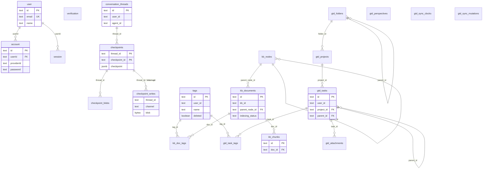
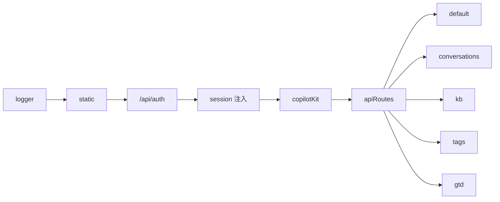

# server

基于 [Hono](https://hono.dev/) + [@hono/node-server](https://github.com/honojs/node-server) 的 HTTP/2 HTTPS 服务
## 前置条件

- Node.js `>=26 <27`（见仓库根 `package.json`）
- pnpm、mkcert（本地 HTTPS 证书，与 client 共用 `certificates/`）
- PostgreSQL（`pnpm devops infra up postgres`）

知识库 / RAG 还需 Qdrant + MarkItDown（`pnpm devops infra up kb`）。详见仓库根 [README](../../README.md) 与 [`.cursor/skills/devops/SKILL.md`](../../.cursor/skills/devops/SKILL.md)。

## 快速开始

```bash
# 仓库根目录
pnpm install
cp .env.example .env
pnpm devops infra up postgres

pnpm --filter server cert
pnpm --filter server dev
# 或根目录 pnpm dev（同时启动 client）
```

默认地址：`https://localhost:3000`（`PORT` 可改）。

`pnpm dev` 经 [scripts/dev.ts](scripts/dev.ts) 预检 Node、`.env`、证书后执行 `tsx watch src/index.ts`。启动时 [src/db/bootstrap.ts](src/db/bootstrap.ts) 自动迁移：

1. better-auth 表（`user` / `account` / `session` / `verification`）
2. Drizzle 业务表（`0000_threads` → `0001_tags` → `0002_kb` → `0003_gtd`）
3. LangGraph checkpoint 表（`PostgresSaver.setup()`）

空库首次启动后可用 `pnpm devops e2e auth` 写入 E2E 账号。

### 环境变量

见仓库根 [`.env.example`](../../.env.example)。复制：`cp .env.example .env`

| 变量 | 说明 |
|------|------|
| `DATABASE_URL` | PostgreSQL（auth + Drizzle 业务表 + checkpoint） |
| `BETTER_AUTH_SECRET` / `BETTER_AUTH_URL` | better-auth |
| `OPENAI_*` / `ANTHROPIC_*` | LLM（各 Agent 图按需） |
| `QDRANT_URL` / `SILICONFLOW_*` / `KB_*` | 知识库 RAG |
| `TUSHARE_TOKEN` | A 股分析 Agent |
| `PORT` | 监听端口（可在 `apps/server/.env` 覆盖） |

Postgres 容器与默认连接串见 [infra/postgres/README.md](../../infra/postgres/README.md)。

## 数据存储（PostgreSQL）

同一 `DATABASE_URL`，三类表由不同子系统创建：

| 子系统 | 谁建表 | 表 |
|--------|--------|-----|
| 账户 | better-auth migrate | `user`、`account`、`session`、`verification` |
| 业务 | Drizzle（[drizzle/](drizzle/)） | 见下 |
| 图状态 / HITL | `PostgresSaver` | `checkpoints`、`checkpoint_blobs`、`checkpoint_writes`、`checkpoint_migrations` |

### Drizzle 迁移（按业务块）

| 文件 | 表 |
|------|-----|
| `0000_threads.sql` | `conversation_threads` |
| `0001_tags.sql` | `tags`（KB / GTD 共用） |
| `0002_kb.sql` | `kb_nodes`、`kb_documents`、`kb_chunks`、`kb_doc_tags` |
| `0003_gtd.sql` | `gtd_folders` / `projects` / `tasks` / `task_tags` / `perspectives` / `attachments` / `sync_*` |

Schema TS：`src/db/schema/{conversation,tags,kb,gtd}.ts`。生成：`pnpm --filter server db:generate`。

### better-auth 账户表（摘要）

- **`user`**：`id`、`name`、`email`（唯一）、`emailVerified`、`image`、时间戳
- **`account`**：登录凭证；邮箱密码时 `providerId=credential`，哈希在 `password`；`userId` → `user`
- **`session`**：`token`（唯一）、`expiresAt`、`userId`
- **`verification`**：验证令牌

配置：[src/auth/auth.ts](src/auth/auth.ts)。

### Checkpoint / HITL

会话消息与挂起中断在 LangGraph checkpoint（非 `conversation_threads` 列）。刷新后由 [CheckpointConnectRunner](src/copilot/checkpointConnectRunner.ts) 投影为 AG-UI 事件。时序见 [wiki/HITL-中断时序.md](../../wiki/HITL-中断时序.md)。

### 结构总览

应用层用 `user.id` / `conversation_threads.id`（= checkpoint `thread_id`）关联，表间无跨子系统 FK。



挂起 HITL：`checkpoint_writes.channel = '__interrupt__'`，blob 为 `{ id, value }`；详情见 [wiki/HITL-中断时序.md](../../wiki/HITL-中断时序.md) §5。

## API

路径挂载在 server 根（非 `/api`）；client 开发代理将 `/api` 去掉前缀后转发。

### 心跳

| 方法 | 路径 | 说明 |
|------|------|------|
| GET | `/`、`/heartbeat` | JSON 心跳（含 ALPN 协议） |
| GET | `/:param` | 动态参数调试 |

### 认证

| 方法 | 路径 | 说明 |
|------|------|------|
| * | `/api/auth/*` | [better-auth](https://www.better-auth.com/)（注册、登录、session） |

### 会话（需登录，`Authorization: Bearer`）

| 方法 | 路径 | 说明 |
|------|------|------|
| GET | `/conversations/graphs` | 可选 Agent 列表 `{ graphs: [{ name, description }] }` |
| GET | `/conversations/list` | 当前用户会话列表 |
| POST | `/conversations/create` | body: `{ agentId: GraphsName }` |
| GET | `/conversations/detail` | query: `id` |
| GET | `/conversations/messages` | query: `id` → `messages` + `threadState`（含服务端 `pendingInterrupt`，供 e2e / 调试；客户端 HITL UI 不读此字段） |
| POST | `/conversations/pin` | 置顶 |
| POST | `/conversations/unpin` | 取消置顶 |
| POST | `/conversations/delete` | 删除会话并 `deleteThread` checkpoint |

`agentId` 与下方 Agent 列表 / `packages/graph` 的 `Graphs` 键一致。

### CopilotKit

| 方法 | 路径 | 说明 |
|------|------|------|
| * | `/copilotkit/*` | CopilotRuntime；需登录；校验 thread 归属 |

AG-UI 流：`streamEvents(v3)` + `@agent/graph` `AguiTransformer`；各 agent 在 [src/agent/graphAgents.ts](src/agent/graphAgents.ts) 注册。

`connect` 时由 [CheckpointConnectRunner](src/copilot/checkpointConnectRunner.ts) 从 checkpoint hydrate 历史消息（`MESSAGES_SNAPSHOT`），有挂起中断则补发 `RUN_FINISHED(interrupt)`。

### 知识库（需登录）

基础路径 `/kb`（client 代理后为 `/api/kb`）。路由风格：动词进 path，全 `POST`。

| 分组 | 路径前缀 | 说明 |
|------|----------|------|
| 文件夹 | `/kb/nodes/*` | 树形节点 CRUD、移动 |
| 文档 | `/kb/documents/*` | 草稿编辑、提交索引、删除 |
| 导入 | `/kb/ingest/*` | 文件 / ZIP / 文本导入（MarkItDown） |
| 检索 | `/kb/query` | 混合召回（调试用） |

完整接口与存储模型见 [docs/kb-api.md](docs/kb-api.md)。

### 标签（需登录）

公共标签（KB / GTD 共用），基础路径 `/tags`（**不是** `/kb/tags`）。

| 方法 | 路径 | 说明 |
|------|------|------|
| POST | `/tags/list` | 当前用户未删除标签 |
| POST | `/tags/create` | `{ name, color? }` |
| POST | `/tags/:id/rename` | `{ name }` |
| POST | `/tags/:id/delete` | `{ mode: untag \| delete_entities, dryRun?, docIds?, taskIds? }` |
| POST | `/tags/:id/update-color` | `{ color }` |

契约：`shared/tags.ts`；详情见 [docs/kb-api.md](docs/kb-api.md) 标签节。

### GTD（需登录）

| 方法 | 路径 | 说明 |
|------|------|------|
| POST | `/gtd/sync/push` | 增量推送 |
| POST | `/gtd/sync/pull` | 增量拉取 |

契约：`@agent/gtd` 的 `PushRequestSchema` / `PullRequestSchema`。

### curl 示例

```bash
curl -sk https://localhost:3000/heartbeat
curl -sk https://localhost:3000/copilotkit/info
# 会话 / kb / tags / gtd 需 Bearer token，见 client 登录后 DevTools
```


## 项目结构

```text
src/
├── index.ts                 # Hono 入口、auth、copilotKit、apiRoutes
├── agent/                   # 图编译、AG-UI 流、错误序列化
├── auth/                    # better-auth
├── conversation/            # checkpoint hydrate、pendingInterrupt、thread 归属
├── copilot/                 # Runtime、CheckpointConnectRunner、honoBridge
├── db/
│   ├── bootstrap.ts         # auth + drizzle + checkpoint 启动迁移
│   ├── checkpointer.ts      # PostgresSaver
│   ├── schema/              # conversation / tags / kb / gtd
│   └── migrate.ts
├── gtd/                     # sync repository / mapper
├── handlers/                # conversations、kb、tags、gtd-sync
├── routes/                  # conversations、kb、tags、gtd、default
├── service/                 # conversation、kb、tags、gtd
└── middleware/
drizzle/                     # 0000_threads → 0003_gtd + meta
shared/                      # 与 client 共享的 zod 契约
docs/kb-api.md
```

## 中间件顺序



## 常用命令

```bash
pnpm --filter server dev          # 开发（含预检）
pnpm --filter server cert         # 生成本地 HTTPS 证书
pnpm --filter server db:generate  # Drizzle 生成迁移
pnpm --filter server db:studio    # Drizzle Studio
```

