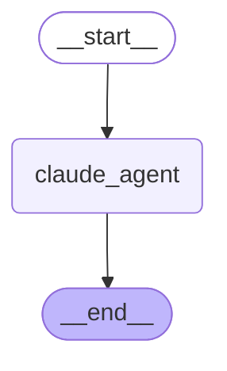
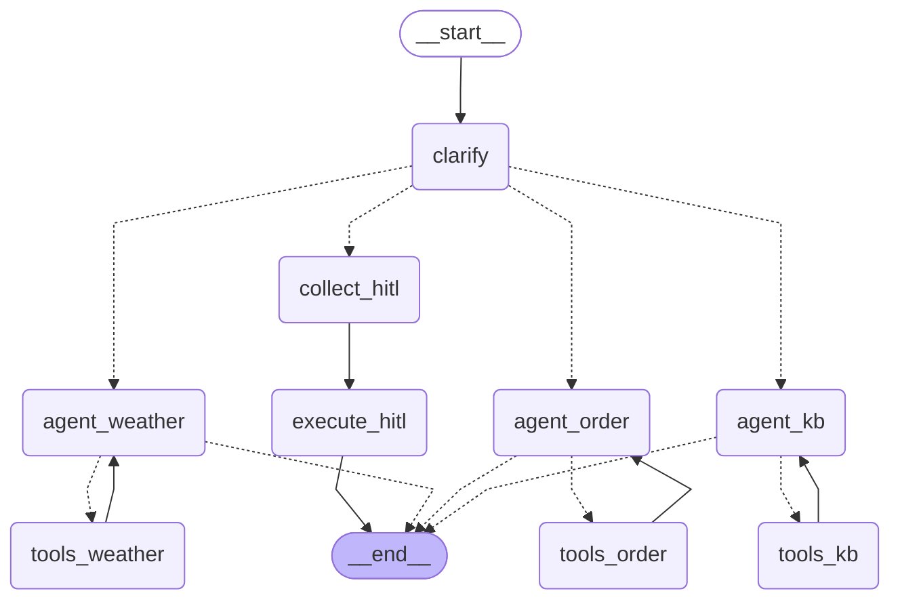
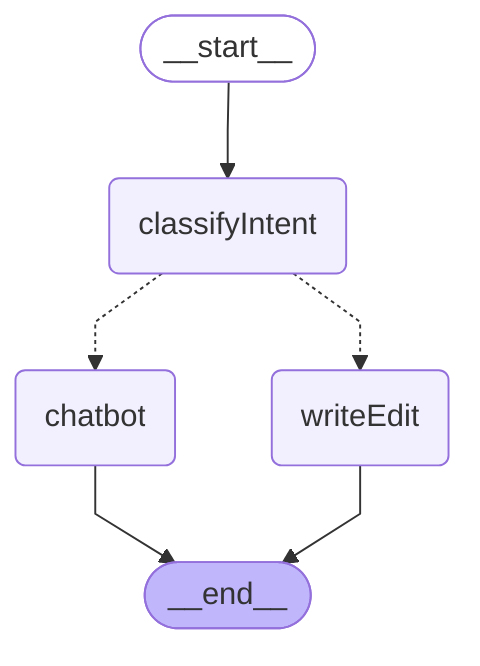
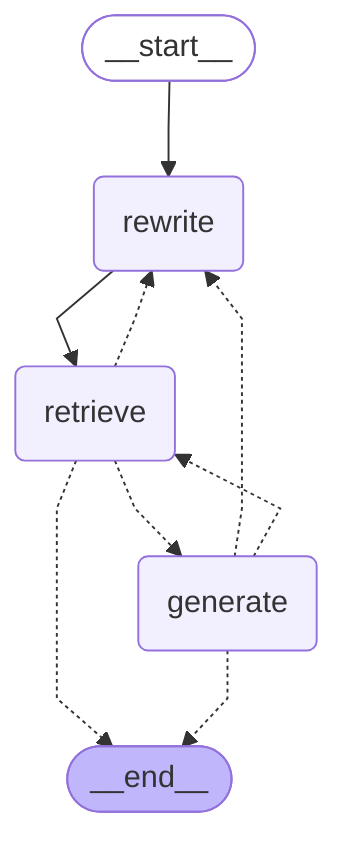
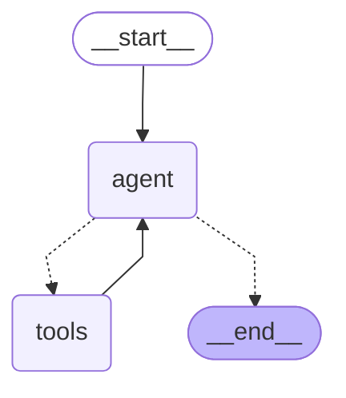
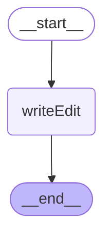

# Graphs

> 由 `pnpm --filter @agent/graph graphs:md` 自动生成（`compile().getGraph().drawMermaid()`）。
> 请勿手改；改图后重新跑命令。

## `claudeAgentGraph`

来源：`src/graphs/claudeAgent.ts`

## `devGraph`

来源：`src/graphs/dev.ts`

## `editorChatGraph`

来源：`src/graphs/editorChat.ts`

## `kbGraph`

来源：`src/graphs/kb.ts`

## `tushareGraph`

来源：`src/graphs/tushare.ts`

## `writerGraph`

来源：`src/graphs/writer.ts`

