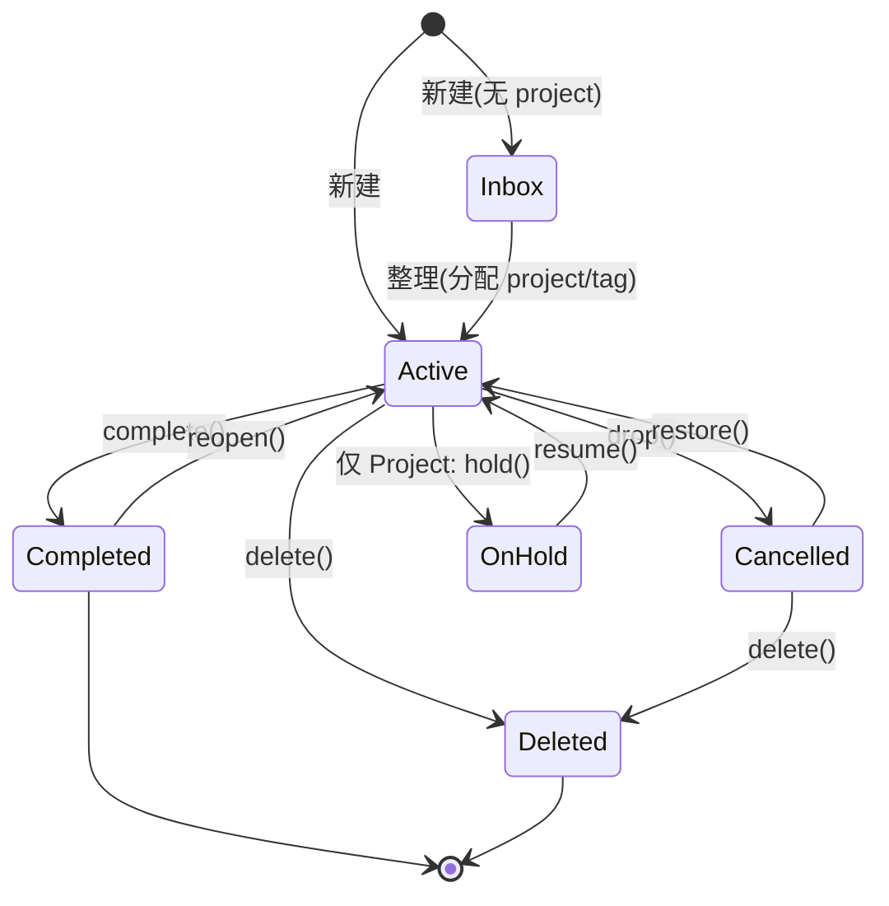
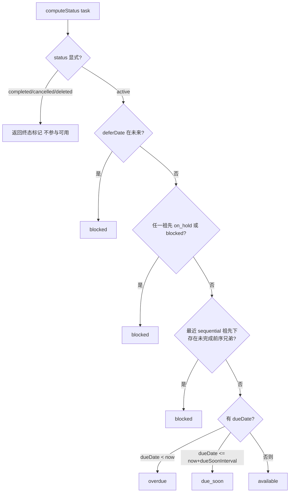
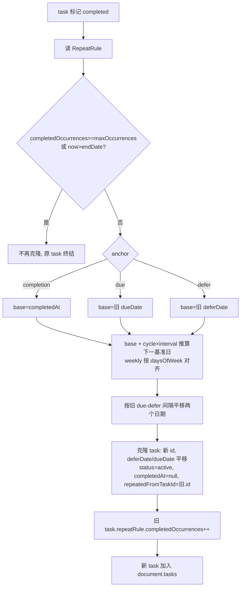
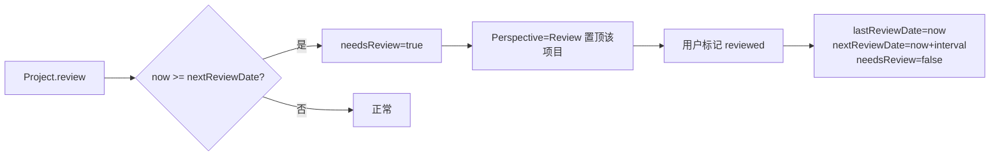
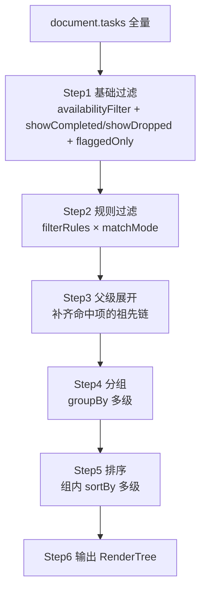
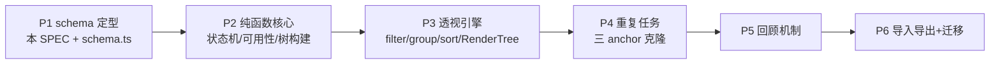

# @agent/gtd SPEC

> 本包以 **zod schema（`src/schema.ts`）为唯一数据结构来源**，description 内嵌于 zod。本 SPEC 描述行为契约：状态机、可用性计算、重复任务、回顾、透视引擎。
>
> **范围约束**：`packages/gtd` 保持纯领域（zod schema + 纯函数，不连 DB/Redis）。持久化由 `apps/server/src/gtd/`（Drizzle Repository、Redis cache）承担；UI 与多端 sync 仍不在本 SPEC 范围。整个 `GtdDocument` 可序列化为单个 JSON，所有领域逻辑为操作该 JSON 的纯函数。

---

## 1. 设计原则

1. **Document as JSON**：所有数据装在 `GtdDocumentSchema`（见 `src/schema.ts`）一棵 JSON 树里，导入/导出即整棵树的序列化。
2. **扁平存储 + id 引用**：实体不深嵌套，用 `projectId` / `parentId` / `folderId` / `tagIds` 互相引用。运行时由逻辑层构建树（Task 树、Folder 树、Tag 树）。
3. **zod 为唯一来源**：字段、类型、约束、描述全部在 zod schema；TS 类型用 `z.infer` 派生，不手写 interface。
4. **显式 vs 派生分离**：`TaskStatus` / `ProjectStatus`（显式，落 JSON）与 `ComputedStatus`（派生，不落 JSON，实时计算）严格分离。
5. **纯函数逻辑**：状态机、可用性、重复、透视均为 `(document, ...) => result` 纯函数，无副作用，便于测试与跨端复用。
6. **持久化在 server**：`GtdRepository` Port 定义于本包；Drizzle 实现、`cache.ts`、HTTP 在 `apps/server`。本包不涉及 UI / 多端 sync。

---

## 2. 数据模型（zod 为源）

所有 schema 定义在 `src/schema.ts`，此处仅列实体清单与关系；字段细节见 schema 的 `.describe()`。

| 实体 | schema | 说明 |
|---|---|---|
| Folder | `FolderSchema` | 组织 Project，可嵌套 |
| Tag | `TagSchema` | 标签，可嵌套，多对多 |
| Project | `ProjectSchema` | 动作容器，含 `type` / `review` |
| Task | `TaskSchema` | 最小执行单元 / action group |
| RepeatRule | `RepeatRuleSchema` | 重复规则 |
| ReviewConfig | `ReviewConfigSchema` | Project 级回顾 |
| Attachment | `AttachmentSchema` | 附件元数据 |
| Perspective | `PerspectiveSchema` | 透视（含 FilterRule/SortKey） |
| GtdDocument | `GtdDocumentSchema` | 顶层文档，整体 JSON |

```mermaid
erDiagram
    FOLDER ||--o{ FOLDER : parentId
    FOLDER ||--o{ PROJECT : folderId
    PROJECT ||--o{ TASK : projectId(顶层)
    TASK ||--o{ TASK : parentId(action group)
    TASK }o--o{ TAG : tagIds
    TAG ||--o{ TAG : parentId
    TASK ||--o| REPEAT_RULE : repeatRuleId
    PROJECT ||--|| REVIEW_CONFIG : review
    TASK ||--o{ ATTACHMENT : attachmentIds
    PERSPECTIVE ||--o{ FILTER_RULE : filterRules
```

### 顶层 GtdDocument

```jsonc
{
  "version": "1.0.0",
  "meta": { "createdAt": "...", "updatedAt": "...", "schemaVersion": "1" },
  "folders":     [ /* Folder[] */ ],
  "projects":    [ /* Project[] */ ],
  "tags":        [ /* Tag[] */ ],
  "tasks":       [ /* Task[] */ ],
  "perspectives":[ /* Perspective[] */ ],
  "repeatRules": [ /* RepeatRule[] */ ],
  "attachments": [ /* Attachment[] */ ]
}
```

---

## 3. 两层状态模型

| 层 | schema | 落 JSON | 说明 |
|---|---|---|---|
| 显式 | `ExplicitStatusSchema` | 是 | Task/Project 共用；用户/系统设定 |
| 派生 | `ComputedStatusSchema` | **否** | 实时计算，见 §5.2 |

值（从 `src/types.ts` 的 `as const` 对象派生，单一来源）：

- `EXPLICIT_STATUS`：`active` / `on_hold` / `completed` / `cancelled` / `deleted`（Task 不应取 `on_hold`，由不变量 §4 约束）
- `COMPUTED_STATUS`：`blocked` / `available` / `due_soon` / `overdue`

> 枚举值定义在 `src/types.ts` 的 `as const` 对象（语义 key + JSDoc + 中文 `_TEXT` 映射），`schema.ts` 用 zod `z.enum(constObject)` 从中派生 schema，TS type 由 `z.infer` 派生——不重复定义字面量数组，const object 为唯一来源。
>
> `cancelled` 对应 OmniFocus 的 dropped（软删，可恢复）；`deleted` 为硬删。

---

## 4. 不变量（Invariants）

逻辑层必须保证以下不变量，违反视为数据损坏：

1. **引用完整**：`projectId` / `parentId` / `folderId` / `tagIds[]` / `repeatRuleId` / `attachmentIds[]` 指向的实体必须存在（null 除外）。
2. **无环**：`Folder.parentId` / `Tag.parentId` / `Task.parentId` 链不得成环。
3. **Inbox 判定**：`Task.projectId === null && Task.parentId === null` ⇔ Inbox 项。
4. **groupType 语义**：`Task.groupType !== null` 时该 Task 应有子 Task（action group）；叶子 action 的 `groupType` 为 null。
5. **顺序唯一**：同级（同 `parentId` 或同 `projectId` 顶层）内 `order` 不重复。
6. **终态时间戳**：`status === completed` ⇒ `completedAt` 非空；`status === cancelled` ⇒ `droppedAt` 非空。
7. **重复实例追溯**：`repeatedFromTaskId` 非空 ⇒ 该 Task 是某重复克隆产物。
8. **派生不落库**：`ComputedStatus` 永不出现在 JSON 中。
9. **Task 不暂停**：`Task.status` 不应为 `on_hold`（暂停单动作用 `deferDate` 或移入 on_hold Project）；`on_hold` 仅 Project 取。

---

## 5. 行为契约（纯函数 spec）

### 5.1 状态机转换



转换函数契约：

| 函数 | 前置 | 后置 |
|---|---|---|
| `complete(task)` | status=active | status=completed, completedAt=now；若有 RepeatRule 则触发 §5.3 克隆 |
| `drop(task)` | status=active/on_hold | status=cancelled, droppedAt=now |
| `delete(task)` | 任意 | status=deleted（逻辑删除，不从 JSON 移除） |
| `hold(project)` | project.status=active | project.status=on_hold |
| `resume(project)` | project.status=on_hold | project.status=active |
| `reopen(task)` | status=completed | status=active, completedAt=null |

> `complete` / `drop` 的级联：父级完成时，OmniFocus 不强制子项完成（子项独立），但视图默认折叠。本 spec 不做级联状态变更，仅级联**派生可用性**（见 §5.2）。

### 5.2 可用性计算 `computeStatus`

输入：`task` + 当前时间 `now` + 构建好的 Task 树。输出：`ComputedStatus`。



伪码（纯函数）：

```ts
function computeStatus(task: Task, now: Date, tree: TaskTree): ComputedStatus {
  if (task.status !== 'active') return 'blocked' // 终态项在 available 视图排除

  if (task.deferDate && new Date(task.deferDate) > now) return 'blocked'

  for (const anc of ancestors(task, tree)) {
    if (anc.status === 'on_hold') return 'blocked'
    if (computeStatus(anc, now, tree) === 'blocked') return 'blocked'
  }

  const seqAncestor = nearestAncestor(tree, task, n => n.groupType === 'sequential')
  if (seqAncestor) {
    const olderSiblings = children(tree, seqAncestor)
      .filter(s => s.order < task.order && s.id !== task.id)
    if (olderSiblings.some(s => s.status === 'active')) return 'blocked'
  }

  if (task.dueDate) {
    const due = new Date(task.dueDate)
    if (due < now) return 'overdue'
    if (due <= new Date(now.getTime() + dueSoonIntervalMs)) return 'due_soon'
  }
  return 'available'
}
```

要点：
- `ancestors` / `nearestAncestor` / `children` 依赖 Task 树（按 `parentId` 构建，根为 `projectId` 顶层）。
- sequential 阻塞基于 `order` 比较；`order` 用 fractional indexing 保证单调。
- `dueSoonIntervalMs` 为全局配置（默认 2 天）。
- **memoize**：以 `(taskId, now分钟级, 树版本)` 为键缓存；任一 Task 状态变更或 `deferDate` 跨越当前时间时失效相关子树。

### 5.3 重复任务克隆 `applyRepeatOnComplete`

当 `complete(task)` 且 `task.repeatRuleId` 非空时触发。



**anchor 语义**（关键）：

| anchor | 下一实例基准日 | 适用 |
|---|---|---|
| `completion` | 本次 `completedAt` | 弹性周期（浇花每 3 天） |
| `due` | 旧 `dueDate` | 固定日期（每月 15 号报表） |
| `defer` | 旧 `deferDate` | 按可开始日（每周一启动） |

**日期推算规则**：
- `daily`：base + `interval` 天。
- `weekly`：base + `interval×7` 天；若设 `daysOfWeek`，对齐到下一个允许的星期几。
- `monthly` / `yearly`：用日期库「加月/年」语义处理月末溢出（1/31 → 2/28）。
- 新实例 `deferDate` 与 `dueDate` 的间隔 = 旧实例两者间隔（保持动作窗口宽度）。仅一个有值时只平移那一个。
- 新实例继承 `name` / `note` / `tagIds` / `projectId` / `parentId` / `order` / `repeatRuleId` / `flagged` / `estimateMinutes`；`completedAt` / `droppedAt` 置 null，`repeatedFromTaskId = 旧.id`，`createdAt` / `updatedAt = now`。

### 5.4 回顾机制



- 回顾是 **Project 级**，回顾时铺开该项目所有未完成 Task 供检视。
- `nextReviewDate` 推算：`lastReviewDate + interval`（custom 用 `customDays`）。首次无 `lastReviewDate` 时以 `createdAt` 起算。
- `needsReview` 本质派生（`now >= nextReviewDate`）。MVP 用纯派生（实时算），性能瓶颈再上冗余定时刷新。

### 5.5 透视引擎（详细）

透视是用户视图的核心：`PerspectiveSchema` 定义规则，引擎对 `GtdDocument` 求值产出渲染树。整个引擎为纯函数 `renderPerspective(doc, perspective, now): RenderTree`。

#### 5.5.1 渲染管线



#### 5.5.2 Step1 基础过滤

先于规则过滤，按视图档位筛除：

| 条件 | 行为 |
|---|---|
| `availabilityFilter=available` | 仅保留 `computeStatus ∈ {available, due_soon, overdue}` 的 active task |
| `availabilityFilter=remaining` | 保留所有 `status=active`（含 blocked） |
| `availabilityFilter=all` | 保留全部 |
| `showCompleted=false` | 排除 `status=completed` |
| `showDropped=false` | 排除 `status=cancelled` / `deleted` |
| `flaggedOnly=true` | 仅保留 `flagged=true` |

> 注意：`available` 档下 `blocked` 被排除，但若其子项为 sequential 的「下一个」仍可见——`available` 判定在叶子层面，父级 group 由 Step3 父级展开补回。

#### 5.5.3 Step2 规则过滤

对每个候选 task，按 `filterRules` 逐条求值，`matchMode` 决定聚合：

- `matchMode=all`：所有规则为真 → 命中
- `matchMode=any`：任一规则为真 → 命中

**FilterField × Op 求值表**：

| field | op | value | 命中条件 |
|---|---|---|---|
| status | eq/ne | TaskStatus 字面量 | task.status ==/!= value |
| status | in | TaskStatus[] | task.status ∈ value |
| project | eq/ne | projectId | task 归属 projectId（含 action group 上溯） |
| project | in | projectId[] | 同上 |
| folder | eq/in | folderId | task 所属 project 的 folderId（递归上溯） |
| tag | eq/in | tagId | task.tagIds 含 value（含 tag 祖先上溯） |
| deferDate | before/after | 时刻 | task.deferDate </> value |
| deferDate | between | [起,止] | task.deferDate ∈ 区间 |
| deferDate | isNull/isNotNull | — | task.deferDate == null / != null |
| dueDate | before/after/between/isNull/isNotNull | 同 deferDate | 同上 |
| flagged | eq | boolean | task.flagged == value |
| estimate | between | [min,max] 分钟 | task.estimateMinutes ∈ 区间 |

> 缺省 `value` 类型不匹配的规则视为 `false`（不命中），不抛错。

#### 5.5.4 Step3 父级展开

当一个子 task 命中过滤但其父 group 未直接命中时，需把祖先 group 一并保留，否则树断裂：

- 收集所有命中 task 的 `parentId` 链上祖先，并入结果集。
- 祖先 group 即便自身不满足规则也保留（作为容器），但默认折叠未命中子项。
- Project 容器同理：若某 project 下有命中 task，该 project 出现在分组中。

#### 5.5.5 Step4 分组

按 `groupBy`（多级键）对命中 task 聚合。多级即嵌套分组：先按 `groupBy[0]`，组内再按 `groupBy[1]`，依此类推。

| GroupKey | 分组依据 | 组顺序 |
|---|---|---|
| project | 归属 Project（上溯） | project.order |
| folder | Project 所属 Folder（递归） | folder.order |
| tag | 每个 tag 一组（一 task 多 tag 时进多组） | tag.order |
| deferDate | 按 deferDate 日期（天） | 日期升序 |
| dueDate | 按 dueDate 日期（天） | 日期升序 |
| flagged | flagged / unflagged 两组 | flagged 在前 |
| status | 按 ComputedStatus | available→due_soon→overdue→blocked |
| none | 不分组（扁平） | — |

**tag 分组的多归属**：一个 task 挂多 tag 时，`groupBy=tag` 下该 task 出现在每个 tag 组内（OmniFocus 行为）。其他 key 单归属。

#### 5.5.6 Step5 排序

组内按 `sortBy`（多级）排序。多级即字典序：先按 `sortBy[0]`，相等再按 `sortBy[1]`。

| SortField | 比较依据 | null 处理 |
|---|---|---|
| dueDate | dueDate 升序 | null 排末尾 |
| deferDate | deferDate 升序 | null 排末尾 |
| flagged | flagged true 在前 | — |
| estimate | estimateMinutes 升序 | null 排末尾 |
| addedAt | createdAt 升序 | — |
| name | 字符串 locale 比较 | — |
| order | order 升序（fractional） | — |

`dir=desc` 反转。多级比较器：对每个 key 按 dir 比较首个非零差值。

#### 5.5.7 Step6 渲染输出 RenderTree

```ts
interface RenderGroup {
  key: string           // 分组键值（projectId / 日期 / 'flagged' 等）
  label: string         // 显示名
  children: (RenderGroup | RenderItem)[]  // 多级分组为子 group，末级为 item
}
interface RenderItem {
  taskId: string
  computed: ComputedStatus  // 派生状态，供 UI 着色
  depth: number             // 在 action group 中的缩进层级
}
```

引擎返回 `RenderGroup[]`（顶层分组数组）。UI 层（本阶段不实现）消费此结构渲染。

#### 5.5.8 内置透视

内置透视即预置的 `Perspective`，规则如下（`availabilityFilter` 默认 `available`，`showCompleted=false`，`showDropped=false`）：

| 内置透视 | filterRules 等价 | groupBy | sortBy |
|---|---|---|---|
| Inbox | `projectId isNull AND parentId isNull` | [none] | [order] |
| Projects | （全量 active） | [project] | [order] |
| Tags | （全量 active） | [tag] | [order] |
| Forecast | `dueDate between [today, today+N]` | [dueDate] | [dueDate] |
| Flagged | `flagged eq true` | [none] | [dueDate, flagged] |
| Review | `project.needsReview=true` | [project] | [order] |
| Completed | `status eq completed`，`showCompleted=true` | [completedAt 日期] | [addedAt desc] |
| Predicted | `dueDate isNotNull` | [dueDate] | [dueDate] |

> Forecast / Predicted 的日历事件聚合（EventKit）本阶段不做，仅聚合 due items。

---

## 6. 导入 / 导出

- **导出**：`serialize(doc: GtdDocument): string` → `JSON.stringify` 校验通过 `GtdDocumentSchema` 的文档。
- **导入**：`parse(json: string): GtdDocument` → `GtdDocumentSchema.parse(JSON.parse(json))`，校验失败抛 ZodError。
- **版本迁移**：`meta.schemaVersion` 标识结构版本；未来结构变更提供 `migrate(doc, fromVer, toVer)` 链式迁移函数（本阶段仅占位）。

---

## 7. 暂不涉及

- **DB 持久化**：不定义 drizzle/pg schema，不涉及存储层。document 以 JSON 形式存在内存或文件。
- **UI**：不实现 React 组件；`RenderTree` 为渲染契约边界。
- **多端同步**：不实现 CRDT / sync server。
- **日历集成**：Forecast 仅聚合 due items，不接入 EventKit。
- **附件二进制**：`AttachmentSchema` 仅存 url 引用，不处理上传/存储。

---

## 8. 落地分阶段



| 阶段 | 产出 | 验收 |
|---|---|---|
| P1 | `src/schema.ts` + 本 SPEC | tc + eslint 零错误，schema 可 parse 示例 JSON |
| P2 | `availability.ts` / `state.ts` / `tree.ts` + 单测 | computeStatus 真值表全覆盖 |
| P3 | `perspective.ts` + 单测 | 内置透视 8 个 render 输出快照 |
| P4 | `repeat.ts` + 单测 | 三 anchor 日期推算 + 终止条件 |
| P5 | `review.ts` + 单测 | nextReviewDate 推算 + needsReview |
| P6 | `serialize.ts` + 迁移占位 | round-trip 导入导出无损 |
